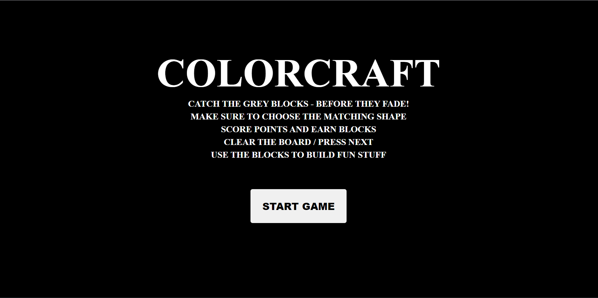
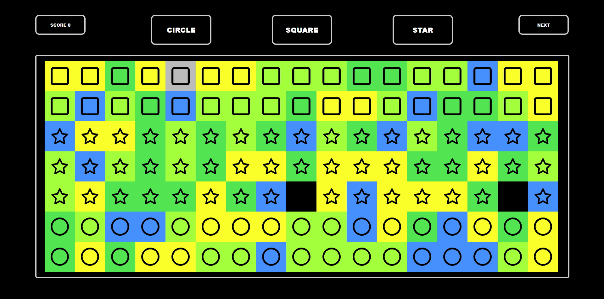
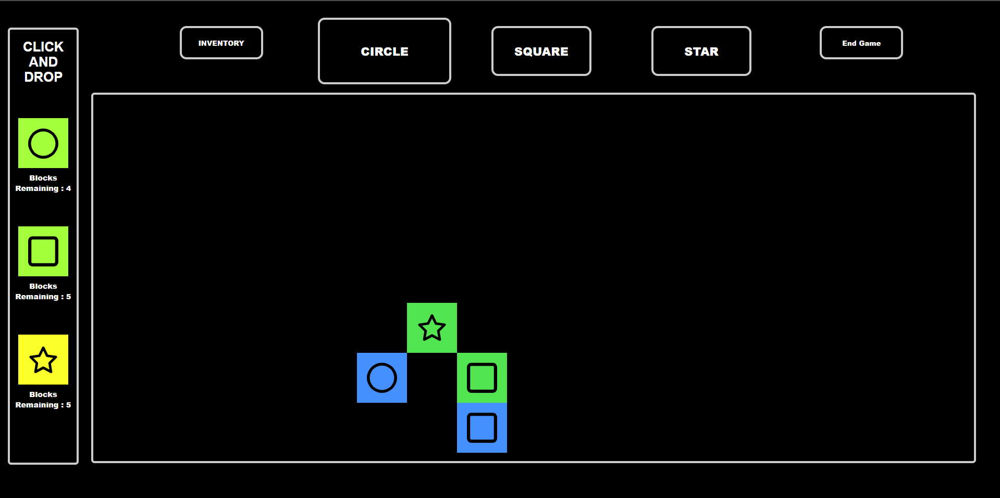

# Minecraft Functionality Implementation Assignment

## Table of Contents
- [About](#about)
- [Instructions](#instructions)
- [Features](#features)
- [Getting Started](#getting-started)
- [Technologies Used](#technologies-used)
- [Contributing](#contributing)
- [License](#license)

---

## About

Welcome to the Minecraft Functionality Implementation Assignment! This project is a game developed as part of a course assignment. The objective of this assignment was to implement Minecraft-like functionalities using vanilla JavaScript, HTML, CSS and our imagination. The game consists of two levels, each with its own unique challenges and goals.

### Overview

In the first level of the game, you are presented with a screen featuring three different types of blocks: square, star, and circle. These blocks initially appear in vibrant colors and gradually turn grey, one by one, for a duration of 2 seconds before disappearing. Your mission is to press the grey blocks before they vanish, thus adding them to your inventory and collecting points. Before you can press a grey block, you must press the corresponding button that matches the block type (e.g., if the block has a star on it, you must press the star button before selecting the grey star block).

Once you have successfully cleared the board or decided to advance, you will transition to the second level of the game. In this step, you have access to the blocks you collected in the previous step, and you can use them to build pictures or structures according to your creativity and imagination. The goal is to let you creativity shine and then share with friends and family.

---

## Instructions

To play the Minecraft Functionality Implementation Assignment game, follow these simple steps:

### Step 1: Block Collection

1. Launch the game by opening the HTML file in a web browser or accessing this link : https://joyful-lily-90f9cd.netlify.app/

2. You will be presented with a screen featuring three types of blocks: square, star, and circle.
3. Initially, the blocks will appear in colorful states.
4. Observe as the blocks gradually turn grey, one by one, and then disappear.

5. To collect a grey block and earn points, press the grey block after pressing the corresponding button that matches its type. For example, press the star button before selecting a grey star block.
6. Continue to press grey blocks in the correct order until you have cleared the board or decide to proceed, to proceed press the "next" button. You will not be permitted to proceed if you have not collected at least one block.

### Step 2: Creative Building

1. After successfully collecting blocks in Step 1 or choosing to proceed, you will advance to the building phase.
2. In this phase, you will have access to the blocks you collected in the previous step.
3. Use your creativity and imagination to build pictures or structures using the available blocks.

4. Experiment with different combinations and arrangements to create unique designs.

Enjoy the game and have fun showcasing your Minecraft-inspired skills!

---

## Features

- Engaging Minecraft-inspired gameplay with two distinct steps.
- Interactive block collection phase with timed challenges.
- Creative building phase to express your creativity.
- Score tracking to monitor your progress.
- Intuitive button and block selection controls.
- Developed using vanilla JavaScript, HTML, and CSS for a lightweight and accessible experience.

---

## Getting Started

To get started with the Minecraft Functionality Implementation Assignment, simply follow these steps:

1. Clone or download the project repository to your local machine.

2. Open the project folder and locate the `index.html` file.

3. Double-click the `index.html` file to launch the game in your web browser.

4. Follow the in-game instructions provided in the "Instructions" section above to play the game.

Have a great time testing your Minecraft skills and creativity!

---

## Technologies Used

This project was built using the following technologies:

- **JavaScript**: Vanilla JavaScript was used for game logic and interactivity.
- **HTML**: HTML was used to structure the game interface and content.
- **CSS**: CSS was utilized for styling and visual enhancements.

---

## Contributing

Contributions to this project are welcome! If you have any ideas, improvements, or bug fixes, please feel free to submit a pull request or open an issue on the project's GitHub repository.

---

## License

This project is licensed under the [MIT License](LICENSE). Feel free to use and modify the code for your educational purposes or personal projects.

---
